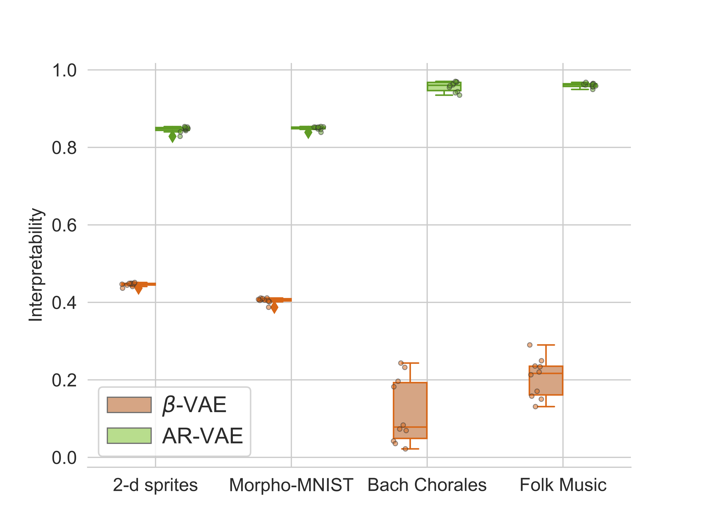
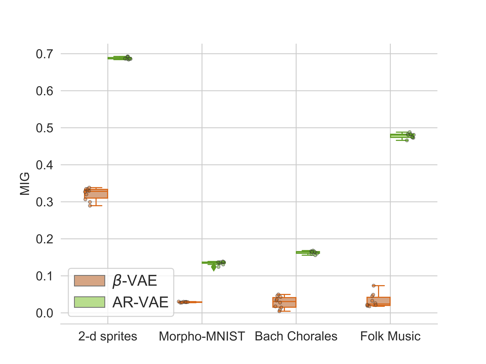
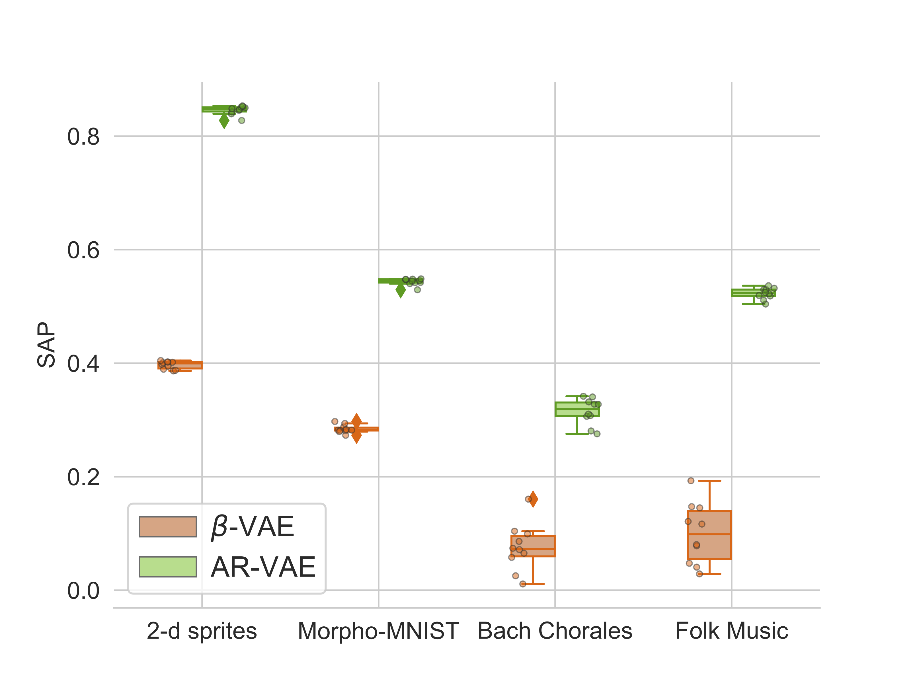

## AR-VAE: Attribute-based Regularization of VAE Latent Spaces

### Introduction 
Selective manipulation of data attributes using deep generative models is an active area of research in the machine learning community. Latent representation-based models such as Variational Auto-Encoders (VAEs) show promise in this direction as they can encode hidden attributes of data. The goal of this research work is to make these latent spaces more **interpretable** by encoding **semantically meaningful attributes** along **specific dimensions** of the latent space. 

使用深层生成模型对数据属性进行选择性操作是机器学习社区中一个活跃的研究领域。潜在的基于表示的模型，如变分自动编码器(VAEs)，在这个方向上有希望，因为它们可以编码数据的隐藏属性。本研究的目标是通过将语义上有意义的属性编码到潜在空间的特定维度上，使这些潜在空间更具可解释性。

**AR-VAE** is a type of Variational Auto-Encoder (VAE) which uses a new supervised training method to create structured latent spaces where specific continuous-valued attributes are forced to be encoded along specific dimensions of the latent space. The figure below shows the main idea behind the AR-VAE model.

** -VAE**是一种变分自动编码器(VAE)，它使用一种新的监督训练方法来创建结构化的潜在空间，其中特定的连续值属性被迫沿着潜在空间的特定维度进行编码。下图显示了AR-VAE模型背后的主要思想。

     

The goal is to structure the latent space such that if the attribute value `a` of one data-point `i` is greater than that of data-point `j`, the latent code correponding to the regularized dimension `r` should also be greater for `i`. This is accomplished by adding a **attribute regularization loss** to the standard VAE-objective using the following steps. See our [paper](https://arxiv.org/pdf/2004.05485.pdf) for more details regarding the method.

目标是构造潜在空间，如果一个数据点“i”的属性值“a”大于数据点“j”，那么对应于正则维“r”的潜在代码也应该大于“i”。这可以通过以下步骤向标准的VAE-objective添加一个**属性正则化损失**来实现。请参阅我们的论文(https://arxiv.org/pdf/2004.05485.pdf)了解更多关于该方法的细节。

### Experimental Results  实验结果
We compare the performance of our model against the [beta-VAE](https://pdfs.semanticscholar.org/a902/26c41b79f8b06007609f39f82757073641e2.pdf) model using datasets from both image and music domains using a wide range of quantitative and qualitative evalution methods. 

我们使用来自图像和音乐领域的数据集，使用广泛的定量和定性评估方法，将我们的模型与[贝塔vae](https://pdfs.semanticscholar.org/a902/26c41b79f8b06007609f39f82757073641e2.pdf)模型的性能进行比较。

1. **Manipulation of Attributes** 操作的属性

Manipulating attributes of 2-d shapes. Each row in the figure below represents a unique shape (from top to bottom): <i>square, heart, ellipse</i>. Each column corresponds to traversal along a regularized dimension which encodes a specific attribute (from left to right): *Shape, Scale, Orientation, x-position, y-position*.

处理二维形状的属性。下图中的每一行代表一个独特的形状(从上到下):<i>正方形，心形，椭圆形</i>。每一列都对应于正则化维度的遍历，该维度编码特定属性(从左到右):*形状、比例、方向、x位置、y位置*。

     
     
     
   

Manipulating attributes of MNIST digits. Each row in the figure below represents a unique digit fronm 0 to 9. Each column corresponds to traversal along a regularized dimension which encodes a specific attribute (from left to right): *Area, Length, Thickness, Slant, Width, Height*.

操作MNIST数字的属性。下图中的每一行表示一个唯一的数字从0到9。每一列都对应于一个正则化维度的遍历，该维度编码特定属性(从左到右):*面积、长度、厚度、斜度、宽度、高度*。

     
     
     
     
     
     
     
     
     
     

Manipulating attributes of monophonic measures of music. In the figure below, measures on each staff line are generated by traversal along a regularized dimension which encodes a specific musical attribute (shown on the extreme left).

     

Piano roll version of the figure above is shown below. Plots on the right of each pianoroll show the progression of attribute values.

     

   

In comparison, the baseline beta-VAE often either fails to encode specific attribute properly or fails to retain the content of the original data (see the right column in the figure below). 

     

 

     

 

2. **Latent Space Disentanglement**

Disentanglement of latent spaces is evaluated using several objective metrics (higher is better). The box plots below show the results for all the four datsets considered. AR-VAE scores better than the baseline across different metrics. 

  
   
  

3. **Reconstruction Fidelity**

The figure below shows examples of reconstruction in the image-based datasets. The AR-VAE model has sharper reconstructions compared to the beta-VAE model.

     

  

### Additional Information
For more information on how use the code in this repository, please see readme of [this](https://github.com/ashispati/ar-vae) repository. For more details regarding the model configurations, experiments, and additional results, please refer our [paper](https://arxiv.org/pdf/2004.05485.pdf).
